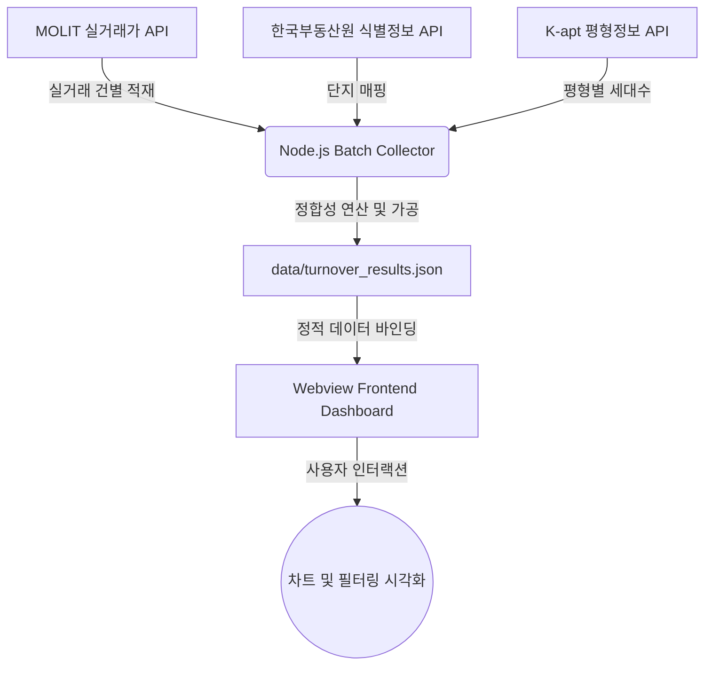

# 아파트 평형별 거래회전율 대시보드 웹뷰 시스템 요구사양서 (spec.md)

본 문서는 아파트 평형별 세대수 대비 거래량을 구하여 정확한 거래회전율을 도출하고, 이를 모바일 앱 웹뷰(Webview) 환경 및 브라우저에서 모던하고 직관적으로 시각화하기 위한 전체 시스템 요구사양서입니다.

---

## 1. 프로젝트 개요
- **목적**: 기존 단지 전체 평균 회전율의 왜곡(대형/소형 평형의 거래 편차 미반영)을 해결하기 위해 **'평형별(전용면적대별) 세대수 대비 거래량'**을 계산하고, 이를 모바일에 최적화된 웹 대시보드로 제공.
- **주요 기능**:
  1. **실제 데이터 일괄 수집(Batch Collector)**: 국토부 실거래가 API, 한국부동산원 단지식별 API, K-apt 평형정보 API를 실키(`b50f1ff0fe1d5f2c7b8b658a870258a2653408e872606d334dd042bf1c54bf99`)로 호출하여 전량 데이터 수집 및 로컬 캐싱.
  2. **회전율 연산 엔진**: 전용면적 기준 오차 매핑(±0.5㎡)을 적용한 평형별 회전율 산출.
  3. **웹뷰 최적화 UI/UX**: 모바일 앱 내 탑재될 수 있도록 HSL 기반 Sleek Dark Mode 디자인 시스템을 적용한 대시보드 화면 제공.

---

## 2. 시스템 아키텍처 및 데이터 흐름



### 데이터 파이프라인
1. **수집기 (Collector)**: `config.js`에 설정된 지역 및 기간별로 실거래가 API를 순회 호출.
2. **단지 식별기 (Identifier)**: 수집된 실거래 데이터 속 단지 정보를 한국부동산원 API를 거쳐 고유 단지 식별코드(`COMPLEX_PK`)로 변환.
3. **평형 정보 매퍼 (Mapper)**: 식별코드를 기반으로 K-apt API로부터 해당 단지의 세대수 구성표를 취득.
4. **회전율 연산기 (Calculator)**: 실거래 면적을 가장 가까운 K-apt 평형 면적에 맵핑한 뒤 $\text{거래량} / \text{세대수} \times 100 (\%)$ 공식을 대입하여 계산 결과를 `data/turnover_results.json`으로 저장.
5. **웹뷰 대시보드 (Webview UI)**: 이 결과 데이터를 로드하여 차트와 테이블로 렌더링.

---

## 3. 웹뷰 화면 설계 (UI/UX)
모바일 앱 내의 Webview에 탑재될 예정이므로 모바일 터치 프렌들리 및 Sleek Dark Mode를 기본 적용합니다.

- **헤더부**: 수집된 기준 지역(예: 서울시 마포구) 및 수집 기간 노출.
- **단지 정보 요약 카드**:
  - 단지명, 총 세대수, 총 거래량, 단지 평균 회전율 제공.
- **평형별 회전율 상세 분석 차트**:
  - ApexCharts/Chart.js 기반 평형별 회전율 막대 차트 제공.
  - 회전율이 높은 평형을 시각적 강조 그라데이션으로 표시.
- **상세 데이터 그리드 (테이블)**:
  - 평형(㎡), 세대수, 거래량, 계산된 회전율(%), 실거래 평균가 정보 제공.
  - 회전율/거래량 기준 오름차순/내림차순 정렬 지원.
- **수집 필터 패널**:
  - 단지명 실시간 검색(Filter), 평형 범위별 필터(소형/중형/대형) 제공.

---

## 4. API 인터페이스 및 인증 정보 사양

### 1) 국토교통부 아파트 매매 실거래 상세자료 조회 서비스
- **Endpoint**: `https://apis.data.go.kr/1613000/RTMSDataSvcAptTradeDev/getAptTradeDevLimit`
- **인증키**: `b50f1ff0fe1d5f2c7b8b658a870258a2653408e872606d334dd042bf1c54bf99` (포털 제공 인코딩/디코딩 호환 키)
- **요청 방식**: `GET`
- **요청 변수**: `LAWD_CD` (법정동 5자리), `DEAL_YMD` (계약월 YYYYMM)

### 2) 한국부동산원 공동주택 단지 식별정보 조회 서비스 (ODCloud 연계)
- **Base URL**: `https://api.odcloud.kr/api`
- **Endpoint**: `/AptIdInfoSvc/v1/getAptInfo`
- **인증키**: `b50f1ff0fe1d5f2c7b8b658a870258a2653408e872606d334dd042bf1c54bf99` (Authorization 헤더 또는 쿼리 `serviceKey`로 전달)
- **요청 방식**: `GET`
- **요청 변수**: `cond[ADRES::LIKE]` (동/주소명 매칭), `page`, `perPage`

### 3) K-apt 공동주택 단지 평형 정보 조회 서비스
- **Endpoint**: `http://apis.data.go.kr/1611000/AptScrapService/getAptAreaInfo`
- **인증키**: `b50f1ff0fe1d5f2c7b8b658a870258a2653408e872606d334dd042bf1c54bf99`
- **요청 방식**: `GET`
- **요청 변수**: `kaptCode` (단지 식별 코드)

---

## 5. 데이터 모델 명세 (`turnover_results.json`)

```json
[
  {
    "apt_name": "마포래미안푸르지오",
    "exclusive_area": 59.96,
    "generation_count": 800,
    "trade_count": 2,
    "turnover_rate": 0.2500,
    "avg_deal_amount": 146000
  }
]
```
